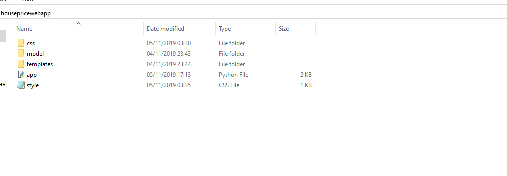
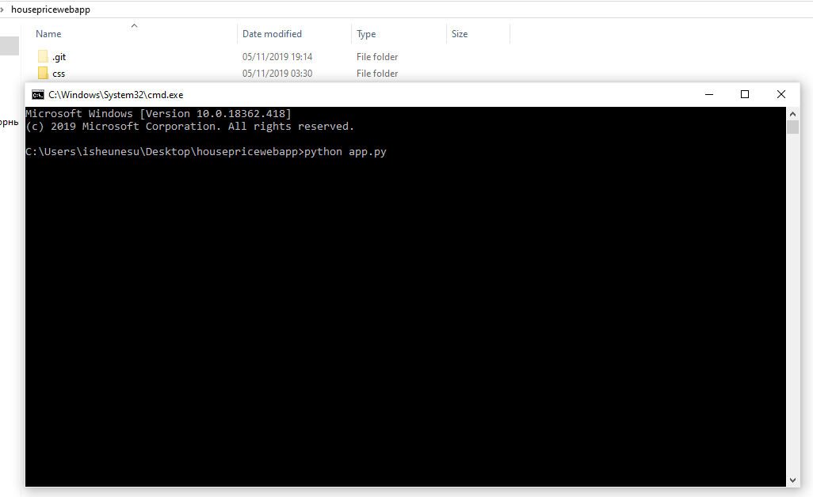
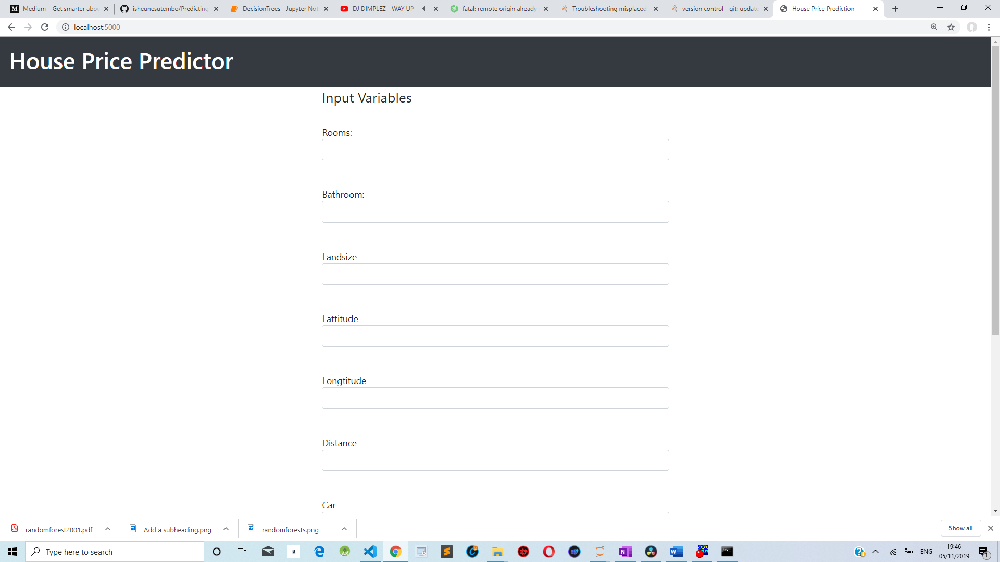
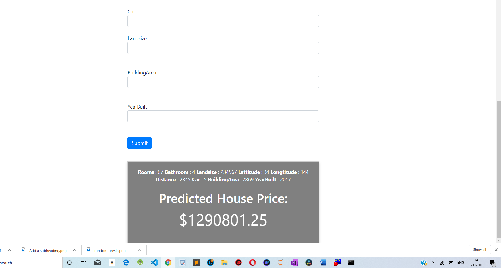

# Predicting-House-Prices-Using-Random-Forest-Flask-Web-Application

<h2>Dependencies for running the web app</h2>

<li>
<ul>Joblib</ul>
<ul>ScikitLearn</ul>
<ul>Flask</ul>
</li>

<h2>Project Folder Structure</h2>

To run the app navigate to the folder where the webapp is located and start command prompt and type "python app.py"

<h2>Web App Screenshots<h2>

